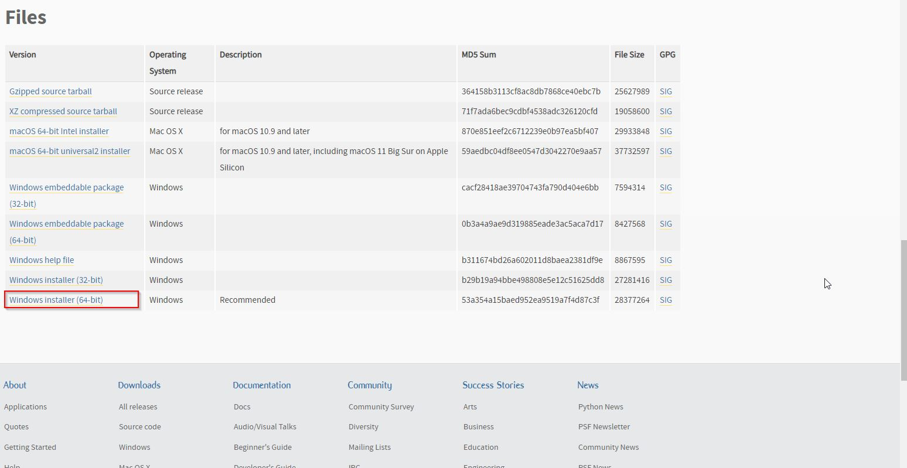
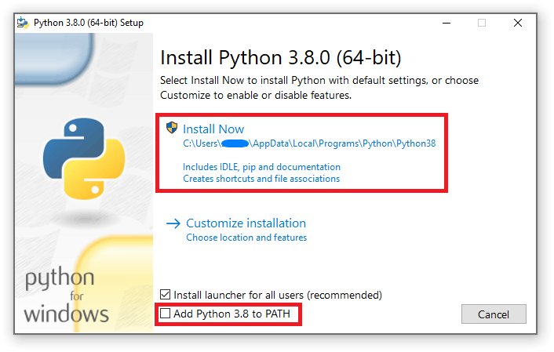

<p>&nbsp;</p>
<p>&nbsp;</p>
<p>&nbsp;</p>

-------------------------------------------
# Installation de python
-------------------------------------------
### Voir le site https://www.python.org/downloads/ et prendre la version la plus récente.




## * S'assurer de cocher la case pour la variable PATH


<p>&nbsp;</p>
<p>&nbsp;</p>
<p>&nbsp;</p>


-------------------------------------------
# Mettre à jour pip (la bibliothèque des librairies Python)
-------------------------------------------
### Faire directement dans cmd (vous pouvez y accéder en faisant Windows+R et inscrire "cmd")
```
python -m pip install --upgrade pip
```
### Installer les requirements avec cette commande
```
pip install -r [chemin_vers_le_fichier\requirements.txt]
ex.: pip install -r D:\Python\Supertrend crypto bot\requirements.txt
```
#### Alternativement, on peut installer chaque librairies une par une en utilisant pip normalement
```
ex.: pip install requests
ex2.: pip install beautifulsoup4
```

<p>&nbsp;</p>
<p>&nbsp;</p>
<p>&nbsp;</p>

-------------------------------------------
# Installer Spyder 
-------------------------------------------
## (optionnel si vous ne voulez pas voir le code source)
### Voir le site pour l'installation : https://www.spyder-ide.org/

## Configurer l'interpréteur


<p>&nbsp;</p>
<p>&nbsp;</p>
<p>&nbsp;</p>

-------------------------------------------
# Exécution
-------------------------------------------
## (il faut que python soit installé et que pip soit à jour en premier)
### Dézipper le fichier
### Partir le code comme ceci dans cmd :
```
python D:/Python/Supertrend crypto bot/supertrend.py
```
#### Alternativement, on peut partir le code dans un IDE comme Spyder